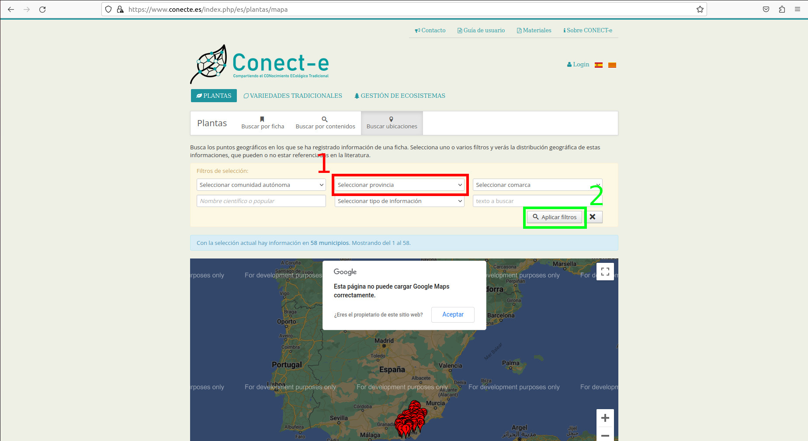
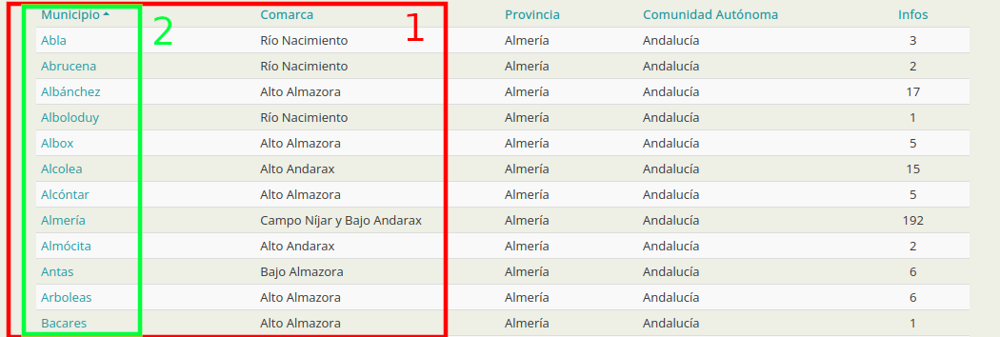
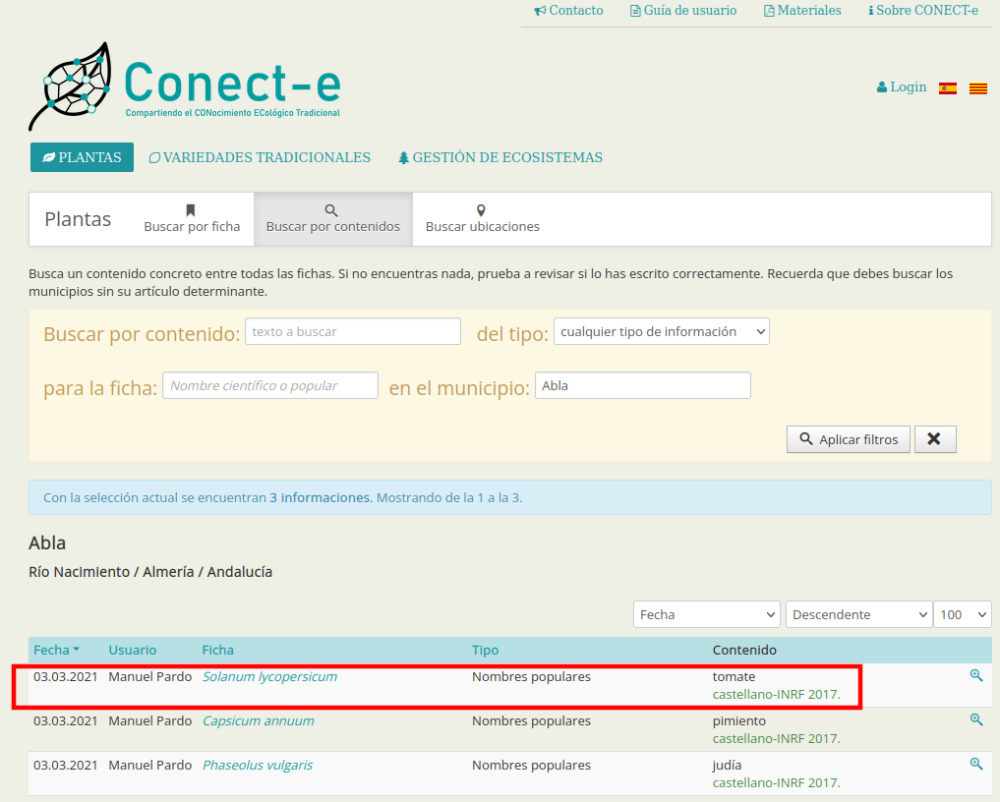
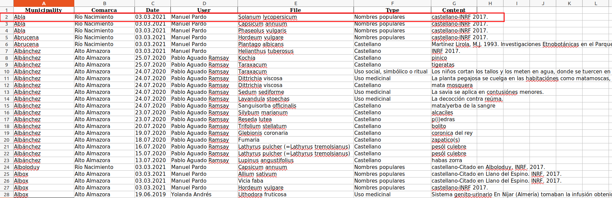

# ConecteScrapping
The progam excracts files from "https://www.conecte.es/index.php/es/plantas/mapa" and export them into an excel by a monitorized way
# Requirements
- Python 3.8.10
- selenium 4.10.0
- pandas 2.0.3
# Use
1. **Selecting province** 
	1.1. Select the province we want, in this example Almería ~ Andalucía  
   1.2. Press 'Aplicar filtros'  
 
2. **Take municipalities one by one** 
   2.1. Save municipality and comarca info  
   2.2. Click into the municipality link 
 
3. **Extract files info** 
	3.1. Take Fecha, Usuario, Ficha, Tipo and Contenido for each file 
 
4. **Export info for each file into an excel** 
   4.1. Each row content Municipality, Comarca, Date, User, File, Type and Content 
 
